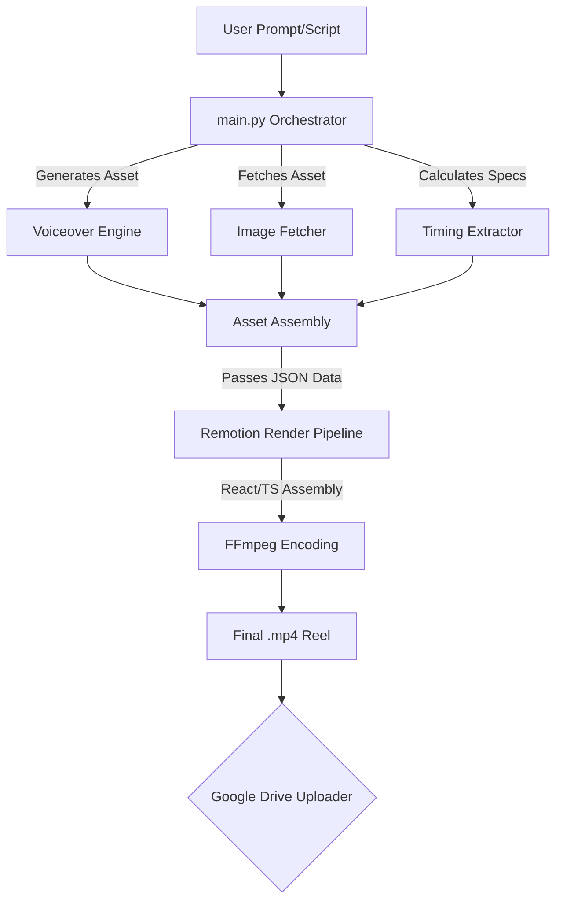

<div align="center">

# 🎬 Scroll.ae - Automated Reel Generator Pipeline
**Transform plain text prompts into breathtaking, professional 9:16 vertical videos in under 60 seconds.**

<p align="center">
  
  
  
  
  
</p>

</div>

---

## 🌟 What is this?

**Scroll.ae** is an entirely autonomous content generation pipeline designed to churn out high-retention, kinetic typography reels with zero manual editing. 

By inputting a simple text prompt, the engine orchestrates a suite of AI technologies and programmatic animation to deliver a fully-finished, ready-to-publish MP4 file. 

### Why Use It?
- ✨ **Word-Synced Animated Text:** Dynamic kinetic typography matching every word.
- 🎙️ **Premium ElevenLabs / Edge-TTS Voiceovers:** Natural sounding AI narration.
- 🖼️ **Relevant B-Roll/Stock Imagery:** Automatically sourced imagery.
- 🎨 **Sleek Remotion Templates:** Uses React-based animation templates to achieve silky-smooth visuals.
- 🚀 **Lightning Fast:** Generates a 30-40 second premium video in **under one minute**.
- ☁️ **Google Drive Auto-Upload:** Automatically sends finished reels securely to the cloud.

---

## 🏗️ Architecture



---

## 🚀 Quickstart Guide

### 1. Prerequisites 
Ensure your system has the following core dependencies installed:
- **Python 3.9+** 
- **Node.js 18+**
- **FFmpeg** (Required by Remotion for video encoding)

### 2. Installation
Clone the repository and set up your dual Python/Node environment:

```bash
# Clone the repository
git clone https://github.com/tohraan/scroll.ae.git
cd scroll.ae

# 1. Setup Python Virtual Environment
python3 -m venv venv
source venv/bin/activate  # On Windows: venv\Scripts\activate
pip install -r requirements.txt

# 2. Setup Node.js Environment (for Remotion)
npm install
```

### 3. Configuration & Credentials

Get your API keys and securely configure your `.env` file from the example:
```bash
cp .env.example .env
```
Fill out the variables inside `.env` depending on the features you plan on using (e.g. `ELEVENLABS_API_KEY`).

**Google Drive Integration (Optional):**
If you want automatic backup to Drive, place your `credentials.json` directly into the `credentials/` folder.

---

## 🕹️ Usage

### Generate Your First Reel
Run the pipeline directly from your terminal. Pass in a direct script using the `--direct` flag and specify an animation preset.

```bash
./venv/bin/python main.py --preset royal_chic --upload --direct "Are inventory errors stealing your time? Let's fix that with custom automations that cut counting by 35%."
```

**Common Flags:**
- `--preset <name>`: Switch between animation presets (e.g., `royal_chic`).
- `--upload`: Automatically upload the output MP4 to Google Drive upon completion.
- `--direct "<text>"`: Bypass LLM generation and directly use the provided text as your script.

Check the `output/` folder for your freshly rendered `reel_royal_chic_XXXX.mp4`.

---

## 🛠️ Project Structure 

This project operates on a split stack: Python for asset orchestration, and React (Remotion) for the final composite render.

```text
📁 scroll.ae/
├── 📝 main.py                  # The main Python orchestrator
├── 🎥 src/                     # React/Remotion animation source (TSX)
├── 🖼️ templates/               # Remotion video templates & overlays
├── 🔌 credentials/             # (Ignored) OAuth tokens & API keys
├── 📦 package.json             # NPM dependencies & Remotion build commands
├── 📦 requirements.txt         # Python dependencies
├── 📜 scripts/                 # Utility scripts (batch runs, drive uploads)
├── 🗑️ archive/                 # (Ignored) Past generated run-scripts
├── 📊 logs/                    # (Ignored) Output logs of past executions
└── 📂 output/                  # (Ignored) Final MP4 video renders
```

---

## 🔮 Extending & Customizing

- **New visual styles:** Head over to `src/` to modify the generic React `.tsx` components and CSS styling. You can add your own Remotion compositions!
- **New prompts/themes:** Create additional text parsing techniques or LLM integrations directly inside the python parser pipeline (`main.py`).

---

## 📜 License & Compliance

MIT Licensed. 

*(Note: If deploying for commercial content creation, ensure you have commercial rights enabled on your external API usage such as ElevenLabs or image providers.)*